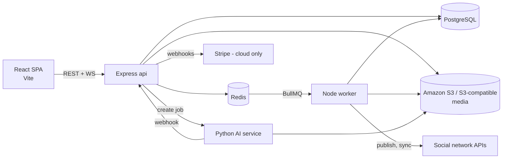
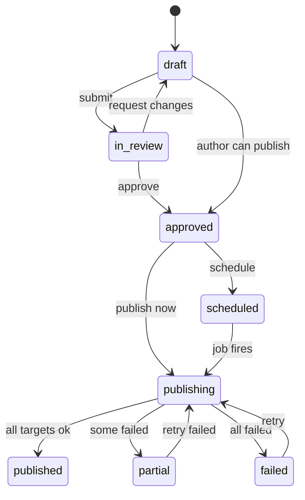
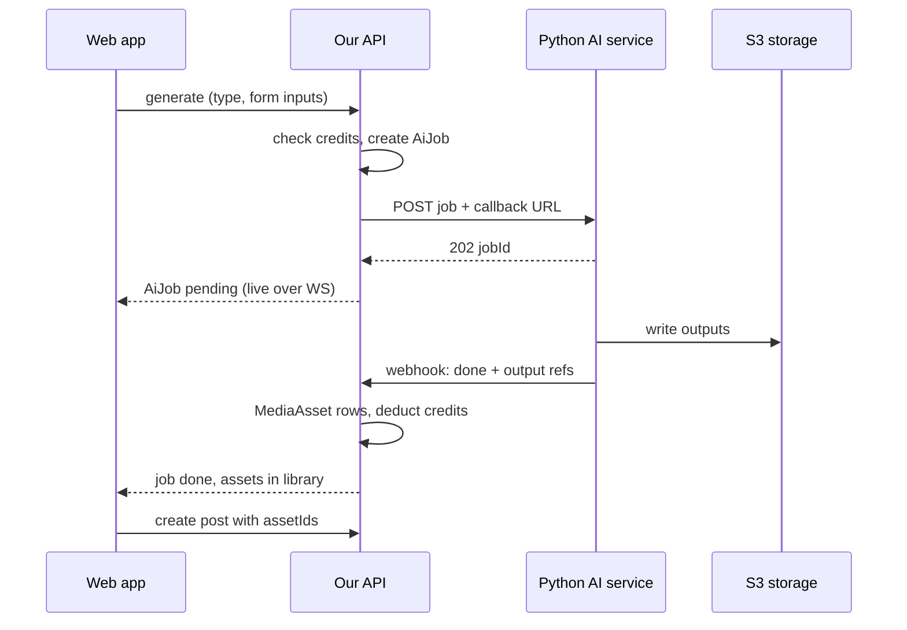

# Socioboard 6.0 — Architecture

As of 2026-09-23 · Live doc: [Architecture & Roadmap](https://claude.ai/code/artifact/0d7f3bc1-1b63-43d4-ba00-774c77c511a4) · See also: [Roadmap](roadmap.md)

## Overview

Socioboard 6.0 rebuilds Socioboard from scratch as a fully open-source (MIT) social media management platform. It is a TypeScript monorepo: a React (Vite) web app, an Express API and a BullMQ worker, on PostgreSQL and Valkey. Socioboard 5.0 serves only as a reference for features and flows; no code carries over.

**Product in one line:** teams connect their social accounts, create content (upload it, or generate it through the AI team's service), get it approved, then publish it now or on a schedule, and track how it performs.

**One edition**

Socioboard 6.0 ships as a single edition with every feature included, all under the MIT license. There is no paid or closed code. The same code runs two ways:

- **Hosted cloud (socioboard.com):** our multi-tenant SaaS. Stripe billing and plan limits are switched on, and AI credits are metered.
- **Self-hosted:** anyone can run it with Docker Compose, using their own network app keys and the open-source AI service with their own model keys. Without Stripe keys, billing is off and everything is unlimited.

Socioboard owns the brand and the 5.0 copyright, so 6.0 is the official next version and can be relicensed. There is no data migration from 5.0: users start fresh and connect accounts to new developer apps.

**Guiding principles**

1. **Durable jobs, not in-memory timers.** Every scheduled post is a persisted BullMQ job that survives restarts and can be retried.
2. **One adapter per network behind a common interface.** Adding or dropping a network does not affect the rest of the system.
3. **One database, one ORM, one language.** Postgres and Prisma replace the old MySQL + MongoDB split. Types are shared from the database to the UI.
4. **The API is the product.** The web app has no business logic of its own, and the OpenAPI spec is generated from the code.
5. **Multi-tenant from day one.** Every row is scoped by workspace, so self-hosted is simply a single-tenant deployment.

**Lessons from 5.0 that shape this design**

- Duplicate, diverging files (`facebookposts.js` and `facebook-posts.js`) → strict lint, one module per concern, CI checks.
- Scheduler held in process memory with a 12-hour reload → BullMQ delayed jobs in Redis, with the post record in Postgres as the source of truth.
- A PHP frontend that just forwarded requests to Node → a React SPA that calls the API directly, using a typed client.
- Plan checks copy-pasted into each route (including a CustomReport check that tested the Discovery permission) → one entitlement guard driven by the plan config.
- Sign-up blocked by required Twilio/SendGrid, and default admin credentials → email magic link or password with pluggable mail (SMTP works). No default credentials; the first user becomes owner.

## Scope

The goal is to match everything in Socioboard 5.0 that still works today, and add AI-generated content. The public 6.0 launch covers publishing, scheduling, all networks, teams, approvals and AI; analytics, discovery, boards, feeds and reports follow in 6.1 (see the [roadmap](roadmap.md)). The feature and network lists below come from reading the 5.0 code. The API status column is from memory as of Sept 2026 and must be verified against each platform's current docs before building.

### Features: 5.0 → 6.0

| Area | In Socioboard 5.0 | In Socioboard 6.0 |
| --- | --- | --- |
| Content creation | User types text and uploads media | Users type and edit text freely. Media is uploaded **or** generated (text/image/video) through the AI service via prompt or input form; AI captions are editable. Only finished media assets can be attached |
| Publishing | Post now, draft, schedule (one-time and day-of-week recurring) | Same, plus per-network variants of a post and a queue of preferred posting time slots |
| Live preview (new) | None | Composer shows a live preview per selected network (how the post will look on Facebook, Instagram, LinkedIn, X, etc.) as the user types, using each adapter's content rules |
| Calendar | Calendar view of schedules | Month/week calendar with drag-to-reschedule |
| Approval | Posts from lower-permission members wait for an admin | Configurable draft → in review → approved → scheduled flow, with comments |
| Teams | Teams, invites, permissions, team reports | Workspaces, members, roles (Owner/Admin/Editor/Contributor/Viewer), invitations |
| Feeds | Read timelines and posts per network | Per-account feed of our published posts and their comments, where the network API allows |
| Discovery / Content Studio | Giphy, Pixabay, Flickr, Imgur, NewsAPI, Dailymotion, RSS | Same sources behind a content-source adapter. Items can be saved into the media library |
| Boards (BoardMe) | Hashtag/keyword boards | Keyword and RSS boards (hashtag search depends on the network's API tier) |
| Analytics | Per-account stats, network insights | Daily metric snapshots per account and per post, with dashboards |
| Reports | PDF reports emailed daily, weekly or monthly | Scheduled PDF/CSV reports by email (white-label option included) |
| Tasks | Assign tasks on posts | Tasks and assignees on posts |
| Team chat | Group chat over Socket.io | Not rebuilt; teams use their own chat tools. Collaboration happens in comment threads on posts |
| Link shortening | Bitly, TinyLink | Bitly plus a pluggable shortener interface |
| Plans | 8 tiers, AppSumo lifetime deals | Stripe plans with limits on the hosted cloud. Self-hosted installs without Stripe keys have no limits |
| Notifications | Socket.io live notifications | In-app notifications over WebSocket, plus email |
| Admin | Separate AdminJS panel on :8080 with default credentials | Platform admin console inside the app (see below): monitoring, users, publishing health, queues, AI, billing, audit log |

### Networks

| Network (5.0 account type) | 6.0 | API notes to verify |
| --- | --- | --- |
| Facebook Pages | Keep | Graph API. Needs Meta app review and business verification |
| Facebook Groups | Drop | Meta deprecated the Groups API in 2024 |
| Facebook personal profile | Drop | Posting to profiles was removed years ago |
| Instagram Business / Creator | Keep | Instagram Graph API: feed posts, carousels, Reels, Stories |
| Instagram personal | Drop | Basic Display API has been shut down; only professional accounts can publish |
| LinkedIn personal | Keep | `w_member_social` scope |
| LinkedIn company pages | Keep | Community Management API, which needs partner approval |
| X / Twitter | Keep | Paid API tier; posting volume depends on the tier |
| YouTube | Keep | Data API v3. Uploads use a large share of the daily quota |
| Pinterest | Keep | API v5, boards and pins |
| Tumblr | Keep | Tumblr API v2 |
| TikTok | Keep | Content Posting API. Posts are private-only until TikTok audits the app |
| Medium | Verify, likely drop | New integration tokens appear to no longer be issued |
| Google+ | Drop | Shut down in 2019 |
| Google Analytics | Later | GA4 Data API for website traffic in reports (not a publishing target) |
| Bitly (utility) | Keep | Link shortening |
| Threads (new, not in 5.0) | Tentative, 6.1 | Threads API from Meta; likely set up under the same Meta developer account |
| Snapchat (new, not in 5.0) | Keep (6.0) | Posting Stories/Spotlight to a Public Profile; likely needs Snap partner or Marketing API access, so apply in phase 0 |

### AI content (new)

The Python AI team owns generation. We own the UI forms, job tracking, media library, credit metering and publishing. A generated asset is saved to the media library like an upload. From that point, posting works the same way no matter where the content came from.

## System architecture

The system is a modular monolith: one Node.js + TypeScript codebase (Express 5 + Zod) deployed as two processes, **api** (HTTP and WebSocket) and **worker** (BullMQ consumers and cron). This replaces 5.0's six services, which shared a database but were deployed and configured separately. Modules have clear boundaries, so one could be split into its own service later if load requires it.



The browser only ever talks to **api**. Anything slow or external (publishing, metric sync, token refresh, report rendering, AI result handling) runs as a job on **worker**.

### Code structure (Express 5 + Zod)

Without a framework enforcing structure, we enforce it by convention and lint:

- **One folder per feature module** (`modules/posts`, `modules/scheduling`, `modules/providers/meta`, ...), each with `routes.ts` → `service.ts` → `repository.ts`, plus `jobs.ts` for its BullMQ processors.
- **Validation:** a `validate({ body, query, params })` middleware runs the Zod schemas from `packages/contracts` on every route; handlers receive typed, validated input.
- **Dependencies are passed in explicitly** (a small factory per module), so modules are easy to test and api and worker wire them the same way.
- **Cross-cutting concerns are middleware:** auth session, workspace scoping, role checks, `requireFeature()` for plan limits, audit logging, rate limiting, one central error handler.
- **Boundaries are enforced in CI** with `dependency-cruiser`: a module may only import another module's public `index.ts`, never its internals.

### Repository layout (pnpm workspaces + Turborepo)

| Path | Contents |
| --- | --- |
| `apps/web` | React + Vite SPA: TanStack Router and Query, Tailwind and our design system (`packages/ui`), calendar and composer |
| `apps/api` | Express 5 HTTP + Socket.IO entrypoint; mounts each module's routes |
| `apps/worker` | Node process that runs the BullMQ processors and repeatable jobs, importing the same modules as api |
| `packages/db` | Prisma schema, migrations, generated client (the seed runs through core: `pnpm db:seed`) |
| `packages/core` | Domain modules shared by api and worker (posts, scheduling, accounts, media) |
| `packages/providers` | One adapter per social network and per content source |
| `packages/contracts` | Zod schemas and TS types shared by API and web; the OpenAPI spec is generated from these |
| `packages/ui` | Shared React components |
| `packages/emails` | React Email templates |
| `apps/ai-mock` | Mock of the Python AI service, used until the real API is ready |
| `packages/billing` | Stripe billing, plans and limits; loaded only when Stripe keys are set |
| `docker/` | Compose files for dev, self-host, and production images |
| `docs/` | This documentation |

The Python AI service is **not** in this repo. It lives in its own repository, `socioboard/socioboard-ai`, owned by the Python team (decided 2026-09-24): separate language, tooling, CI and release cycle, and the only link between the two is its HTTP API and signed webhook.

## Tech stack

The stack below includes the agreed decisions (React + Vite, Node TS, Postgres + Prisma, BullMQ + Redis, Express + Zod, Better Auth, Stripe). The rest are proposed defaults, marked with an asterisk; override any of them.

| Layer | Choice | Why |
| --- | --- | --- |
| Frontend | React + Vite, TypeScript | Agreed. A fast dev server, and it can be served as a static SPA from any CDN |
| Routing / data* | TanStack Router + TanStack Query | Type-safe routes; caching and invalidation for server data |
| UI | Tailwind CSS v4 + our design system on Radix (shadcn-style, own styling), FullCalendar for the calendar | Decided: no designer, so we build our own design system. Visual direction chosen on 2026-09-28: Graphite with glass, Aurora palette, light and dark ([design system](frontend/design-system.md)) |
| Backend | Express 5 on Node 24 LTS, TypeScript | Agreed. Familiar to the team; Express 5 handles async errors properly. Structure comes from our module convention (below) |
| API docs | OpenAPI 3.1 from Zod 4's built-in JSON Schema (`buildOpenApi` in contracts; `zod-to-openapi` was the plan, not needed) | Generated from the same Zod schemas that validate requests, so it can't drift; validated against the official OpenAPI 3.1 schema in tests |
| Validation* | Zod schemas shared in `packages/contracts` | One schema validates both the web forms and the API |
| Database | PostgreSQL 17+ + Prisma | Agreed. Replaces MySQL + MongoDB; JSONB covers the flexible per-network payloads |
| Queue / jobs | BullMQ on a Redis-compatible store (Valkey 8 by default; Redis works too) | Agreed. Delayed jobs, retries with backoff, per-queue rate limits, repeatable cron jobs. Valkey is BSD-licensed, which avoids Redis 8's license terms for self-hosters |
| Auth | Better Auth (organization plugin) | Self-hostable. Covers email/password, magic link, OAuth login, orgs, invitations and roles |
| Billing (hosted cloud) | Stripe (Better Auth Stripe plugin + metered usage) | Subscriptions, customer portal, AI-credit metering |
| Media storage | Amazon S3 by default; a bundled S3-compatible server when there is no S3 account (RustFS in dev; self-host decides in phase 5), or any S3-compatible service via `S3_ENDPOINT`. Same S3 client in every case | Uploads go straight to storage through presigned URLs; the API never proxies large files |
| Realtime* | Socket.IO on the api server, Redis adapter | Notifications and live job status; scales across api instances |
| Email* | Nodemailer (SMTP) + React Email templates | Any SMTP provider works; no vendor lock-in like 5.0's SendGrid |
| PDF reports* | Headless Chromium (Playwright) rendering React pages | Reports reuse the dashboard components |
| Observability* | Pino logs, OpenTelemetry (traces, metrics, logs) to self-hosted OpenObserve, built-in alerts, Bull Board | Structured logs; free, self-hosted tracing and error views; queue dashboard for ops |
| Testing* | Vitest, Supertest, Playwright E2E, recorded provider fixtures | Adapters are tested against recorded API responses |
| Tooling* | pnpm, Turborepo, ESLint, Prettier, Changesets, GitHub Actions | Monorepo builds with caching |

## Data model

Every domain table has a `workspaceId`, and all queries go through a Prisma extension that adds the workspace scope automatically. The extension only sees top-level queries, so nested writes (`connect`, raw foreign-key values) are covered in the database instead: relations between workspace-owned tables use **composite foreign keys** `(xId, workspaceId) → (id, workspaceId)` (with `@@unique([id, workspaceId])` on the target), so Postgres rejects a row in one workspace pointing at a row in another. A **Post** is the content a user writes once. Each **PostTarget** is one delivery of that post to one social account. Scheduling, status and results all live on the PostTarget.

| Entity | Key fields | Notes |
| --- | --- | --- |
| User, Session, Account, Verification | Managed by Better Auth; User has an `isPlatformAdmin` flag | `Account` here means a login identity (Google, password), not a social account |
| Workspace (Better Auth organization) | name, slug, timezone, plan | Replaces 5.0's Team |
| Member, Invitation | userId, workspaceId, role | Roles: owner, admin, editor, contributor, viewer |
| SocialConnection | network, externalUserId, displayName, encrypted tokens, tokenExpiresAt, status | One per **login** to a network. Any number per network, so several Facebook users can be connected to one workspace |
| SocialAccount | connectionId, network, externalId, displayName, avatar, asset token (if the network issues one), status | One per connected Page, profile or channel, reached through a login. Tokens are encrypted with AES-GCM |
| SocialAccountGroup | name, accountIds | Saved sets of accounts, for picking targets quickly |
| MediaAsset | kind (image/video/gif), storageKey, mime, size, width, height, duration, source (upload / ai / discovery), aiJobId? | The media library. AI outputs are stored here like uploads |
| AiJob | type (text/image/video), input JSON, status, externalJobId, outputs, creditsUsed, error | Tracks each request sent to the Python service |
| Post | authorId, status, baseContent (text, mediaIds, link), labels | status: draft, in_review, approved, scheduled, publishing, published, partial, failed |
| PostTarget | postId, socialAccountId, contentOverride JSON, scheduledAt, status, externalPostId, permalink, attempts, lastError | One per account; publish jobs act on this row |
| PostApproval / PostComment | postId, userId, decision or body | Approval history and discussion |
| RecurringRule | postId, RRULE, timezone, nextRunAt | Covers 5.0's day-of-week recurring schedules |
| QueueSlot | socialAccountId, weekday, time | Preferred posting times for "add to queue" |
| MetricSnapshot | socialAccountId or postTargetId, date, metrics JSON | Daily time series for analytics |
| ContentSource, Board, RssFeed | type, config, keywords | Discovery (Giphy, Pixabay, NewsAPI, RSS…) and boards |
| Task | postId?, assigneeId, dueAt, status | Tasks on posts |
| ReportSchedule | frequency, recipients, accountIds, format | Scheduled email reports |
| Notification | userId, type, payload, readAt | In-app notification feed |
| AuditLog | actorId, action, entity, diff | Approvals, compliance, and every platform-admin action |
| FeatureFlag, Announcement | key, rules, message, window | Managed from the admin console |
| Subscription, UsageRecord | stripeIds, plan, period, aiCredits | Billing and metering; used only when billing is enabled |

## Publishing & scheduling pipeline

Postgres is the source of truth, and BullMQ only executes the work. When a post is scheduled, we write `PostTarget.scheduledAt` and add a delayed job whose ID is derived from the target and its schedule version. Rescheduling bumps the version and replaces the job. If Redis is ever lost, a reconciler recreates any missing jobs from Postgres.



The post's status is computed from its targets' statuses. Whether an author can skip review depends on their role and a workspace setting.

### Queues

| Queue | Job | Behavior |
| --- | --- | --- |
| `publish` | Publish one PostTarget | Delayed until `scheduledAt`. Up to 5 attempts with exponential backoff, only for retryable errors. Idempotent: skips if `externalPostId` is already set |
| `media-prepare` | Transcode or resize for a network | Runs before publishing, e.g. IG aspect ratio, X size limits, YouTube/TikTok upload sessions |
| `token-refresh` | Refresh expiring OAuth tokens | Runs every hour; marks the account `reauth_required` and notifies admins if refresh fails |
| `account-health` | Check each login can still post to its accounts | Runs daily; an account the login lost access to becomes `reauth_required` with the reason, one that came back is active again |
| `metrics-sync` | Pull account and post metrics | Runs daily per account, plus at 1h/24h/7d after each publish |
| `recurring` | Expand RecurringRule into PostTargets | Runs hourly and looks 7 days ahead |
| `reconcile` | Recreate missing delayed jobs, fail stuck `publishing` targets | Runs every 5 minutes |
| `ai-result` | Pull finished AI outputs into the media library | Triggered by the AI service webhook |
| `reports` | Render and email scheduled reports | Repeatable, per ReportSchedule |
| `notifications` | Email and in-app fan-out | Triggered by events |

### Rules

- **Validate before scheduling, not at publish time.** Each network adapter exposes its rules (character limit, media count, aspect ratio, video length, file size). The composer shows errors live, and the API rejects posts that break them. In 5.0 these checks happened at publish time.
- **Rate limits per network and per account.** Each adapter declares its limits; the publish worker keeps every account and every OAuth app under them with a shared limiter in Valkey (BullMQ's group limiter is Pro-only), delaying a job without using a try. A "slow down" answer pauses that account or app, and is retried at the time the network's headers say.
- **Retry only what can succeed.** Errors are classified as `retryable` (timeout, 5xx, 429), `auth` (token revoked → reauth, no retry) or `content` (rejected by the network → fail with the network's message).
- **Timezones.** All times are stored in UTC and shown in the workspace or user timezone. Recurring rules keep their timezone so they don't shift with daylight saving time.

## Social network integration layer

Each network is one adapter in `packages/providers` that implements a common `SocialProvider` interface. The rest of the system never calls a network API directly. In 5.0 there was a large `switch (account_type)`; here a provider registry takes its place, and a network's adapter is registered only when its keys are configured.

```ts
interface SocialProvider {
  id: NetworkId;                         // 'facebook_page', 'linkedin_org', ...
  capabilities: Capabilities;            // text, image, carousel, video, story, reel, link, firstComment ...
  rules: ContentRules;                   // limits used by the composer + validation
  auth: { getAuthUrl(state); exchangeCode(code); refresh(account); listAssets(token) };
  publish(target: PublishInput): Promise<PublishResult>;   // returns externalId + permalink
  delete?(account, externalId): Promise<void>;
  fetchAccountMetrics?(account, range): Promise<Metrics>;
  fetchPostMetrics?(account, externalIds): Promise<Metrics[]>;
  fetchFeed?(account, cursor): Promise<FeedPage>;
}
```

- **Connecting accounts (multi-account on every network).** One OAuth flow per network handles state, PKCE and callback. A workspace can connect **any number of logins per network** (e.g. several Facebook users), each stored as a SocialConnection, and **any number of assets per login**: `listAssets` lets the user pick which Pages, orgs or channels to add, each becoming a SocialAccount. Adding a second login uses the network's account picker where one exists; otherwise the user is guided to switch accounts first.
- **Tokens.** Stored encrypted (AES-256-GCM, key from env / KMS), never sent to the browser, and refreshed ahead of expiry by the `token-refresh` queue.
- **Self-host vs cloud.** Each deployment registers its own developer app on each network, using keys from env. Our hosted cloud uses our own reviewed apps. The docs will include a setup guide per network (what 5.0's Configuration.README only listed as links).
- **Content sources** (Giphy, Pixabay, Flickr, Imgur, NewsAPI, Dailymotion, RSS) use a smaller `ContentSource` interface: `search(query) → items`. Items can be imported into the media library.
- **Testing.** Each adapter has contract tests run against recorded HTTP fixtures, plus a nightly smoke test against sandbox accounts where the network offers them.

Build order is by user value and approval lead time: Meta (FB Pages + IG) → LinkedIn → X → YouTube → Pinterest → TikTok → Snapchat → Tumblr. Submit the app reviews and access requests for Meta, LinkedIn, TikTok and Snapchat in week 1, because approval takes weeks.

## AI content integration

The Python team designs and owns the AI API, in its own repository `socioboard/socioboard-ai`. We consume it through a single `AiGateway` module, so their contract can change without affecting the rest of the app. Until their spec arrives, we build against a mock service that follows the expectations below.

**Contract between the two repos:** an OpenAPI file in `socioboard-ai` is the source of truth for the AI API and webhook payloads. Our `apps/ai-mock` implements that file, and CI in this repo checks the mock against the latest published spec so a change on their side shows up as a failing check here, not as a production error. Their service ships as a Docker image (`ghcr.io/socioboard/socioboard-ai`) with semver tags; we pin a version in our Compose files and bump it deliberately.



**What the UI covers:** a prompt box plus form templates per content type (e.g. "product launch post": product, audience, tone, target networks). Users can generate several variations and regenerate or edit text. Only completed assets can be attached to a post.

### What we need in their contract

- [ ] **Async jobs** for image and video: submit returns a `jobId` right away, completion comes by signed webhook (HMAC), plus a `GET /jobs/{id}` fallback for polling. Text can be synchronous or streamed.
- [ ] **Input schemas** per generation type, ideally as JSON Schema, so we can render the forms automatically.
- [ ] **Target network hints** so outputs fit the network: aspect ratio, max duration, character limit. We send the adapter's `ContentRules`.
- [ ] **Output delivery**: files written to a shared S3 bucket or returned as presigned URLs we copy from, with mime type, dimensions, duration and file size.
- [ ] **Usage reported per job** (tokens, seconds, images) so the hosted cloud can meter credits.
- [ ] **Tenant and idempotency keys**: we send `workspaceId` and an `Idempotency-Key`, so retries don't create duplicate jobs.
- [ ] **Errors** as `{code, message, retryable}`, including content-policy refusals the user should see.
- [ ] **Auth** between services (API key or mTLS) and a sandbox environment.
- [ ] **Self-hostable packaging** (decided: the Python service is open source too, in `socioboard/socioboard-ai`): a Docker image (`ghcr.io/socioboard/socioboard-ai`) that self-hosters run with their own model provider keys, included in our Compose file as an optional `ai` profile.
- [ ] **OpenAPI spec** in their repo, versioned with the service, for the API and the webhook payloads.

## Auth, roles & billing

Better Auth runs inside the API and handles sign-up, sessions (httpOnly cookies), workspaces, invitations and roles, on every install. Billing and plan limits switch on only when Stripe is configured.

**Sign-in methods:** email + password with verification, magic link, and Google/Microsoft OAuth. 2FA (TOTP) and SAML/OIDC SSO are available to everyone (SSO arrives in 6.1). Mail goes through any SMTP server. If no SMTP is configured on a self-hosted install, the first user can verify from the server logs instead of editing SQL by hand as in 5.0.

### Roles

| Permission | Owner | Admin | Editor | Contributor | Viewer |
| --- | --- | --- | --- | --- | --- |
| Billing, delete workspace | Yes | — | — | — | — |
| Invite members, connect accounts | Yes | Yes | — | — | — |
| Approve posts | Yes | Yes | Yes | — | — |
| Publish/schedule without review | Yes | Yes | Yes | — | — |
| Create drafts, generate AI content | Yes | Yes | Yes | Yes | — |
| View calendar and analytics | Yes | Yes | Yes | Yes | Yes |

A workspace setting can require review for every post, including posts by Editors. Access can also be limited to specific social accounts per member, as 5.0's team-to-account links allowed.

### Billing and plan limits (when Stripe is configured)

- **Stripe plans** hold limits in product metadata: social accounts, members, scheduled posts per month, AI credits per month, analytics history in days, and feature flags such as Discovery, Reports, approval workflow and white-label.
- **One `requireFeature('feature')` middleware plus a limits service** enforces these. When billing is off (no Stripe keys), the same guard always allows. This replaces 5.0's copy-pasted plan checks.
- **AI credits** are a monthly allowance plus Stripe metered overage. Each AiJob debits a credit ledger, and usage is reported to Stripe.
- **Webhooks** (checkout completed, subscription updated or deleted, invoice payment failed) update the local `Subscription`. There are grace periods, and downgrades are handled by pausing accounts over the limit rather than deleting data.
- **Lifetime/AppSumo-style codes** can be added later as a coupon type (5.0 had these).

## Platform admin console

A `/admin` section inside the same web app for Socioboard staff (platform admins) to monitor and operate the whole service. It is separate from workspace roles: a workspace Owner or Admin only manages their own team.

| Area | What operators see and do |
| --- | --- |
| Overview | Sign-ups, active workspaces, posts published and failed today, queue backlog, AI usage and cost, MRR when billing is on |
| Users & workspaces | Search, inspect, suspend or restore, change plan, extend trial, grant AI credits, view-only "view as user" for support |
| Publishing health | Success and failure rates per network, top error reasons, stuck or failed posts with retry and cancel, expiring or revoked tokens |
| Queues | Bull Board embedded: backlog, failures and retries per queue |
| Network APIs | Rate-limit and quota usage per network (e.g. YouTube quota, X tier), app review status |
| AI | Jobs, failures, turnaround, cost per workspace, credit ledger |
| Billing | Subscriptions, failed payments and refunds, with links into Stripe |
| Controls | Feature flags, in-app announcements, maintenance mode, spam and abuse flags |
| Audit log | Every admin action: who, what, when |

- **Access:** a platform-admin flag on the user, separate from workspace roles. 2FA is mandatory for platform admins.
- **Support access is view-only.** "View as user" can read but never post or change settings, is audit-logged, and is visible to the customer.
- **Infrastructure monitoring stays in standard tools** (OpenObserve, Bull Board). The console covers the business and operations view and links out for the rest.
- **Self-hosted:** included, since there is one edition. The first user on an install becomes platform admin.
- **Phasing:** queues and publishing health in phase 2; users, workspaces, billing, AI, controls and audit log in phase 5; growth and usage dashboards in 6.1.

## Platform: storage, licensing, deployment, security

### Media storage

Browsers upload directly to S3 using presigned multipart URLs. The API then records a `MediaAsset` and queues a job that extracts metadata and makes thumbnails. Some networks require a public URL they can fetch from (Instagram, Pinterest, TikTok), so the worker creates short-lived presigned GET URLs for them. Networks fetch those URLs directly from S3, so self-hosted installs need nothing extra as long as their bucket is on S3 or another internet-reachable S3-compatible service.

### Licensing and the billing switch

The whole repo is MIT (changed from AGPL-3.0 on 2026-09-28), with no private or license-keyed code. Anyone may use, change and host Socioboard, commercially too, without publishing their changes; they keep the copyright and license notice. The hosted cloud stands on what the license doesn't cover: our reviewed network apps, our hosted AI service and operating it well. Contributions arrive under the same MIT license, so no CLA is needed; a CONTRIBUTING guide (with DCO sign-off) comes before accepting outside PRs. Billing lives in `packages/billing` and loads only when `STRIPE_SECRET_KEY` is set; otherwise every workspace is unlimited. The hosted cloud is the same code with billing turned on, plus our reviewed network apps and our hosted AI service.

### Deployment

- **Images:** `web` (static files on nginx or Caddy), `api`, `worker`, `migrate` (one-off `prisma migrate deploy`). They are multi-arch and published to GHCR.
- **Self-host:** one `docker compose up`, including Postgres, Valkey and Caddy with automatic HTTPS. Media goes to the installer's S3 bucket, or to a bundled S3-compatible server (optional profile) if they have none; MinIO is then served publicly through Caddy at the media domain so networks can fetch files. Configuration is one `.env` validated at startup, and missing network keys just hide that network. This replaces 5.0's five separate JSON config files.
- **Cloud:** the same images, hosted on a provider chosen later. api and worker scale separately.

### Environments and domains

The web app and API share one origin per environment, with the API served under `/api`. That keeps httpOnly session cookies first-party, avoids CORS, and needs one TLS certificate.

| Environment | App + API | Media (public URLs for IG, Pinterest, TikTok) | Notes |
| --- | --- | --- | --- |
| Production | `app.socioboard.com` (API at `/api`) | `media.socioboard.com` | Marketing site and legal pages stay on `socioboard.com` |
| Staging | `app-dev.socioboard.ai` | Same host, `/public-media/` | Used for QA and app-review demos. Runs under PM2 on one server, not the images (decided 2026-10-06, [infra](infra.md#staging-pm2)) |
| Local dev | `https://<name>.dev.socioboard.com`, a Cloudflare Tunnel to localhost | Same tunnel | A public HTTPS URL is needed because TikTok and Instagram reject plain localhost callbacks, and Stripe/AI webhooks must reach the machine |

- **OAuth callbacks:** `https://<app host>/api/oauth/<network>/callback`, e.g. `https://app.socioboard.com/api/oauth/linkedin/callback`.
- **Webhooks:** `/api/webhooks/stripe`, `/api/webhooks/ai`, and Meta's data-deletion callback at `/api/webhooks/meta/data-deletion`.
- **Legal pages for app reviews:** `socioboard.com/privacy`, `socioboard.com/terms`, `socioboard.com/data-deletion`.
- **Developer apps:** one production app per network holding the production callbacks, plus one development app per network holding the staging and dev callbacks (on Meta, a test app linked to the production app). Staging can't break the reviewed production app this way.
- **Self-hosters** set one `APP_URL`; every callback and webhook URL is derived from it.

### Security baseline

- **Tokens and secrets:** encrypted at rest; secrets only in env or a secret manager; no default credentials anywhere.
- **Rate limiting and body limits:** rate limits per IP and per user (disabled in 5.0), request bodies capped at 1 MB (5.0 allowed 100 MB), and file uploads go only to S3.
- **Webhooks:** Stripe and AI webhooks are verified by signature, and OAuth `state` is signed.
- **Web security:** CSRF protection on cookie sessions and a strict CSP.
- **Dependencies and releases:** Renovate for updates, CodeQL in CI, SBOM published with releases.
- **Tenant isolation:** two layers. A Prisma extension scopes every top-level query to the workspace, and relations between workspace-owned tables use **composite foreign keys** `(xId, workspaceId) → (id, workspaceId)` (with `@@unique([id, workspaceId])` on the target), so Postgres rejects a row in one workspace pointing at a row in another. Tests check that data can't leak across workspaces, including through nested writes.
- **Platform compliance:** Meta data-deletion callback, GDPR account export and deletion, a retention policy for tokens and metrics, and public privacy policy / terms pages that app reviews require.
- **AI content labels:** assets from an `AiJob` are marked as AI-generated, and adapters set the network's AI-disclosure flag where the API offers one (verify TikTok, YouTube and Meta fields at build time).

### Observability

Pino JSON logs carry request and job IDs. OpenTelemetry traces follow a request from the API through the queue and worker to the network call, and go with logs, metrics and errors (the browser's too) to self-hosted OpenObserve; nothing is paid for (see [infra](infra.md#observability)). Built-in alerts email platform admins when publishing fails in bulk or queues back up. Bull Board shows queue health inside the admin console. Every post shows its publishing history, with the network's error message, to the user.
